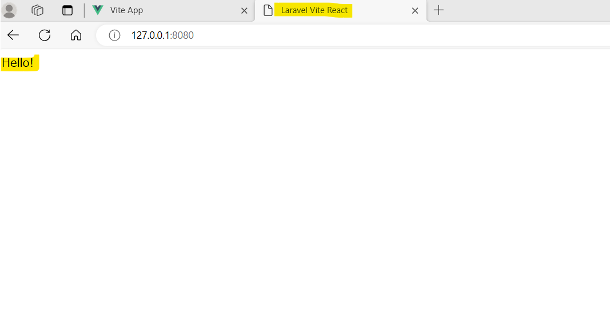

# Develop Environment
a
Name | Version | Description
----|------|----
Windows|11|OS
WSL(ubuntu)|2|Linux terminal
Docker|24.0.6|container-based virtualization

# Environment in Docker

Name | Version | Description
----|------|----
PHP | 8.1 |Programming Language for Backend
Laravel|9.19|Web Framework
commposer|2.9.14|Dependency Manager for PHP 
npm|9.6.7|Package Manager for JavaScript
Vue.js|3.2.46| Frontend Framework
Vite|4.0.0|Building tool for Frontend
nginx|1.18|Web Server
PostgreSQL|11.7|Database


# How to Start

```bash
# git clone

# Build docker container
docker-compose build
# Startup Docker
docker-compose up -d
# Check if docker is startedup or not
docker ps -a
# Enter app Container result->[root@????:/workspace#] 
docker-compose exec app bash
# Make .env
cp .env.example .env
# Update composer
composer update
# Update npm ->Result: Generate node_module dir
npm update
# Execute　vite
npm run dev
# Open new terminal,then Enter app container
docker-compose exec app bash
# workspace以下をアクセスできるようにする。
chmod 777 -R ../workspace/
# Make Table in DB-container
php artisan migrate
# Open Server  --port is Option
php artisan serve --port=8080

# Open Under Address
http://127.0.0.1:8080/
```

# after First
```bash

# Startup Docker
docker-compose up -d
# Enter app Container result->[root@????:/workspace#] 
docker-compose exec app bash
# Execute　vite
npm run dev

# Open new terminal,then Enter app container
docker-compose exec app bash
# Open Server  --port is Option
php artisan serve --port=8080

# Open Under Address
http://127.0.0.1:8080/
```
# Result 

http://127.0.0.1:8080/




# Refference

## Readbule アセットの構築

https://readouble.com/laravel/9.x/ja/vite.html

https://cyublog.com/articles/php-ja/jp-docker-laravel9-vite/

